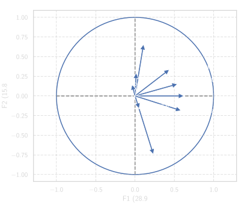
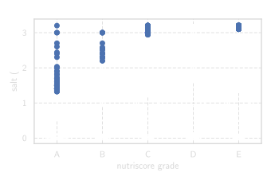

# Public Health Nutrition Analysis

**OpenFoodFacts Database Exploration for Health Insights**

---

## 🎯 Objective

Analyze the OpenFoodFacts database to support public health initiatives by identifying nutritional patterns, data quality issues, and potential insights for health recommendations. The goal is to evaluate the feasibility of using this crowdsourced dataset for a nutrition-focused mobile application.

## 📊 Dataset

**Source**: [OpenFoodFacts](https://world.openfoodfacts.org/) - Collaborative, free, and open database of food products from around the world

**Size**: ~900,000+ products with nutritional information

**Key Features**:
- Nutritional values (energy, fat, saturated fat, carbohydrates, sugars, proteins, salt, etc.)
- Nutri-Score grades (A, B, C, D, E)
- PNNS food groups (French National Nutrition and Health Program classification)
- Product categories and brands
- Country of origin

**Challenges**:
- Missing data and incomplete records
- Outliers and data quality issues
- Crowdsourced nature requires careful validation

## 🧠 Approach

### Part 1: Data Cleaning (`01_cleaning.ipynb`)

**Data Quality Assessment**:
- Identification of missing values across nutritional fields
- Detection and handling of outliers using statistical methods
- Data validation and consistency checks

**Preprocessing Steps**:
- Removal of products with insufficient nutritional information
- Outlier treatment strategies (capping, removal, or transformation)
- Feature selection based on completeness and relevance
- Creation of clean dataset for exploration

### Part 2: Exploratory Data Analysis (`02_exploration.ipynb`)

**Univariate Analysis**:
- Distribution of Nutri-Score grades across products
- Nutritional value distributions (histograms, box plots)
- Analysis of missing data patterns

**Multivariate Analysis**:
- Correlation analysis between nutritional components
- ANOVA testing for differences across food groups
- Principal Component Analysis (PCA) for dimensionality reduction

**Food Group Analysis**:
- Nutri-Score distribution by PNNS food groups
- Nutritional patterns within product categories
- Identification of healthy vs. unhealthy product segments

## 📈 Results

### Data Quality Insights

- Significant missing data challenges identified in crowdsourced dataset
- Outlier detection revealed data entry errors requiring systematic cleaning
- Nutri-Score coverage varies significantly across product categories

### Nutritional Pattern Discovery

**PCA Findings**:
- First two principal components explain key nutritional variance
- Clear separation between food groups in nutrient space
- Energy, fat, and sugar content drive primary variance



**Food Group Characteristics**:
- Beverages: Low energy, high sugar variability
- Dairy products: High protein and calcium
- Snacks: High energy density, poor Nutri-Scores
- Fruits/Vegetables: Best Nutri-Score distribution



### Statistical Validation

- ANOVA confirmed significant nutritional differences across food groups
- Salt content varies dramatically by category (condiments vs. fresh foods)
- Nutri-Score effectively discriminates product healthiness

## 🔑 Key Learnings

**Data Science Skills**:
- Handling large-scale, real-world datasets with quality issues
- Appropriate outlier detection and treatment strategies
- Multivariate statistical analysis (PCA, ANOVA)
- Effective data visualization for exploratory analysis

**Domain Insights**:
- Crowdsourced data requires systematic validation
- Nutri-Score is a useful but incomplete health indicator
- Food categorization (PNNS groups) provides valuable analytical structure
- Missing data patterns are non-random and category-dependent

**Practical Recommendations**:
- OpenFoodFacts is viable for health applications with proper data cleaning
- Focus on categories with high data completeness (dairy, beverages, snacks)
- Supplement with additional data sources for underrepresented categories
- Implement data quality filters in production applications

## 📁 Project Structure

```
project-02-foodfacts/
├── README.md                    # This file
├── 01_cleaning.ipynb            # Data cleaning and preprocessing
├── 02_exploration.ipynb         # Exploratory data analysis
└── figures/                     # Visualizations
    ├── ANOVA/                   # Statistical test results
    ├── PCA/                     # Principal component analysis
    ├── knn/                     # K-NN analysis
    ├── pie/                     # Distribution charts
    └── scatter/                 # Correlation plots
```

## 🛠️ Technologies

- **Python 3.x**
- **Data Processing**: pandas, NumPy
- **Statistics**: SciPy, scikit-learn
- **Visualization**: Matplotlib, Seaborn
- **Analysis**: PCA, ANOVA, correlation analysis

---

**Date**: January 2023
**Training Program**: OpenClassrooms × CentraleSupélec — Machine Learning Engineer
