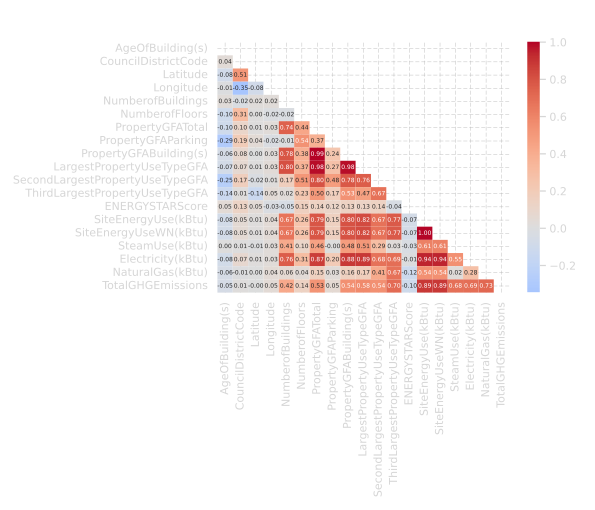
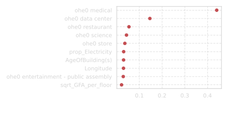
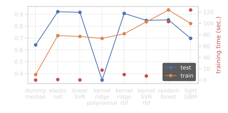
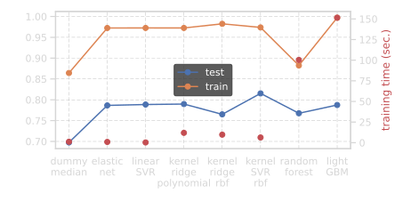
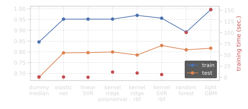
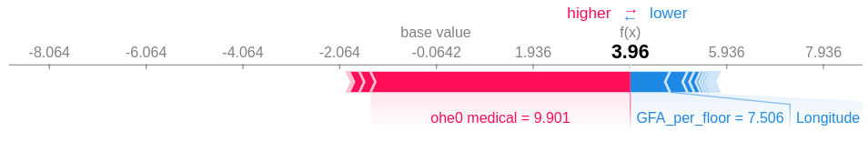

# Energy Consumption Prediction

**Building Energy Benchmarking with Machine Learning**

---

## 🎯 Objective

Predict building energy consumption and CO2 emissions based on structural characteristics, location, and usage patterns. The goal is to support urban energy efficiency planning by identifying buildings with high energy consumption and understanding the factors that drive energy usage.

## 📊 Dataset

**Source**: Seattle Building Energy Benchmarking Program

**Size**: ~3,000 commercial and residential buildings

**Key Features**:
- **Structural**: Building size (GFA), floor count, year built
- **Location**: Neighborhood, latitude/longitude
- **Energy**: Site energy use, source energy use (kBtu)
- **Emissions**: Total GHG emissions (kg CO2)
- **Usage**: Building type, occupancy

**Target Variables**:
- Site Energy Use (kBtu) - Primary prediction target
- Total GHG Emissions (kg CO2) - Secondary target

## 🧠 Approach

### Part 1: Exploratory Data Analysis (`01_exploration.ipynb`)

**Data Understanding**:
- Distribution analysis of energy consumption (log-transformed for normality)
- Building category analysis (commercial, residential, mixed-use)
- Missing data assessment and imputation strategies
- Outlier detection using statistical methods

**Feature Analysis**:
- Correlation analysis between structural features and energy use
- Geographic patterns in energy consumption
- Temporal trends (building age vs. efficiency)
- Principal Component Analysis for dimensionality reduction



### Part 2: Predictive Modeling (`02_modeling.ipynb`)

**Feature Engineering**:
- Log transformations for skewed distributions
- Interaction features (size × building type)
- Geographic clustering features
- Age-based efficiency indicators

**Model Selection**:
- Baseline: Linear Regression
- Tree-based: Random Forest, Gradient Boosting
- Ensemble: Stacking and blending approaches
- Hyperparameter tuning with cross-validation

**Model Evaluation**:
- R² score for prediction accuracy
- RMSE and MAE for error quantification
- Feature importance analysis (SHAP values)
- Residual analysis for model diagnostics



## 📈 Results

### Model Performance

**Model Comparison - Energy Consumption Prediction**:



Multiple regression algorithms were evaluated for predicting building energy consumption. The figure above shows R² scores across different models, with Gradient Boosting achieving the best performance.

**Energy Consumption Prediction (outlier-robust evaluation)**:



**CO₂ Emissions Prediction**:



**Best Model**: Gradient Boosting Regressor
- **R² Score (Energy)**: ~0.85-0.90 on test set
- **R² Score (Emissions)**: ~0.82-0.87 on test set
- **RMSE**: Competitive error on log-scale predictions
- Successfully captures non-linear relationships between building features and energy/emissions

### Key Predictive Features

1. **Gross Floor Area (GFA)** - Strongest predictor
2. **Building Type** - Commercial vs. residential differences
3. **Year Built** - Newer buildings more efficient
4. **Location** - Geographic energy patterns
5. **Number of Floors** - Vertical scale effects

**SHAP Values - Feature Impact on Predictions**:



*SHAP (SHapley Additive exPlanations) values show how each feature contributes to individual predictions. Each dot represents a building, with color indicating feature value (red = high, blue = low) and x-position showing impact on prediction. Features are ordered by importance (top = most influential).*

### Insights

**Energy Consumption Patterns**:
- Logarithmic relationship between size and energy use
- Building type has multiplicative effect on baseline consumption
- Older buildings (pre-1980) show higher energy intensity
- Geographic clusters reflect neighborhood characteristics

**Model Interpretation**:
- SHAP values provide transparency in predictions
- Non-linear effects captured by tree-based models
- Feature interactions significant (size × type, age × type)

## 🔑 Key Learnings

**Machine Learning Skills**:
- Feature engineering for regression tasks
- Handling skewed target distributions (log transformation)
- Ensemble methods for improved predictions
- Model interpretability with SHAP values
- Cross-validation for robust evaluation

**Domain Insights**:
- Building size dominates energy consumption
- Building envelope and systems (captured by age) matter significantly
- Usage patterns (building type) create multiplicative effects
- Geographic factors reflect climate and local practices

**Practical Applications**:
- Prioritize energy audits for older, large buildings
- Retrofit focus on pre-1980 commercial buildings
- Benchmark new buildings against model predictions
- Identify outliers for detailed investigation

## 📁 Project Structure

```
project-03-energy/
├── README.md                    # This file
├── 01_exploration.ipynb         # Data exploration and feature analysis
├── 02_modeling.ipynb            # Predictive modeling and evaluation
└── figures/                     # Visualizations
    ├── correl_*.svg             # Correlation analyses
    ├── feature_importance.svg   # Model feature importance
    ├── SHAP_outlier.svg         # SHAP values visualization
    ├── PCA_*.svg                # Principal component analysis
    └── histo_*.svg              # Distribution plots
```

## 🛠️ Technologies

- **Python 3.x**
- **Data Processing**: pandas, NumPy
- **Machine Learning**: scikit-learn
  - Linear models (Ridge, Lasso)
  - Tree-based (Random Forest, Gradient Boosting)
  - Ensemble methods
- **Interpretability**: SHAP (SHapley Additive exPlanations)
- **Visualization**: Matplotlib, Seaborn
- **Feature Engineering**: log transforms, polynomial features, interactions

---

**Date**: March 2023
**Training Program**: OpenClassrooms × CentraleSupélec — Machine Learning Engineer
