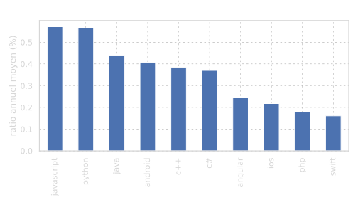
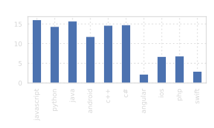
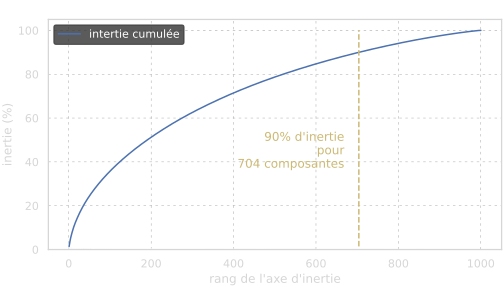
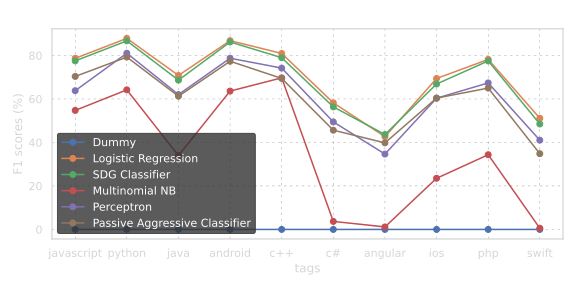
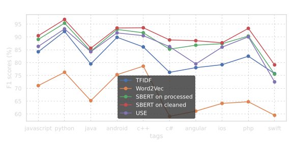
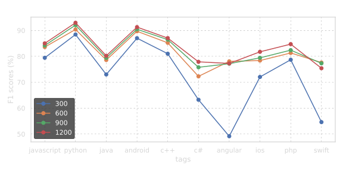
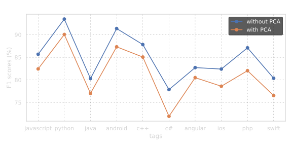
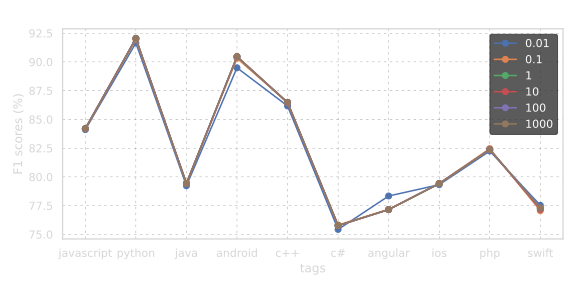
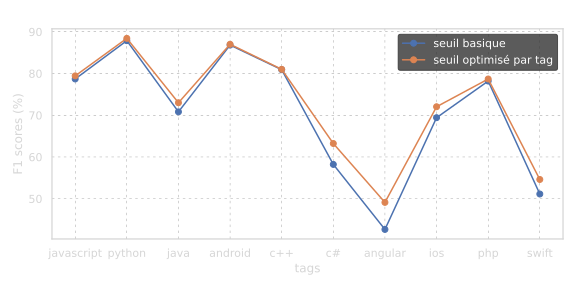

# Automatic Question Categorization

**NLP System for Technical Question Classification with API Deployment**

---

## 🎯 Objective

Build an NLP system to automatically categorize technical questions by topic (tags) for a Stack Overflow-like platform. The system uses both unsupervised learning (topic modeling) and supervised classification to assign relevant tags to questions, with a REST API for production deployment.

## 📊 Dataset

**Source**: Stack Overflow questions dataset

**Size**: ~50,000-100,000 technical questions

**Key Features**:
- **Text data**: Question title, body content
- **Labels**: User-assigned tags (programming languages, technologies, topics)
- **Metadata**: Post date, user ID, score
- **Multi-label**: Questions can have multiple tags

**Preprocessing Challenges**:
- HTML content in question bodies
- Code snippets mixed with natural language
- Technical jargon and acronyms
- Highly skewed tag distribution

## 🧠 Approach

### Part 1: Exploration & Topic Modeling (`01_exploration.ipynb`)

**Data Exploration**:
- Tag frequency distribution (power law)
- Question length analysis (title vs. body)
- Temporal trends in question topics
- Multi-label statistics

a**Tag Distribution Analysis**:

<p align="center">
  
  
</p>

*Left: Most frequently used tags in the dataset. Right: Proportion of tags showing heavy skewness (Zipf's law distribution).*

**Text Preprocessing**:
- HTML tag removal
- Code block extraction/removal
- Tokenization and lemmatization
- Stop word removal (general + technical)
- Lowercase normalization

**Unsupervised Topic Discovery**:
- TF-IDF vectorization
- Latent Dirichlet Allocation (LDA)
- Non-negative Matrix Factorization (NMF)
- Topic coherence evaluation
- Topic-tag alignment analysis



### Part 2: Supervised Classification (`02_modeling.ipynb`)

**Feature Engineering**:
- TF-IDF with various vocabulary sizes (5k, 10k, 25k tokens)
- N-gram features (unigrams, bigrams)
- PCA for dimensionality reduction experiments
- Title vs. body vs. combined features

**Model Selection**:
- Logistic Regression (One-vs-Rest)
- Support Vector Machines (Linear SVM)
- Multinomial Naive Bayes
- Random Forest baseline

**Optimization**:
- Hyperparameter tuning (regularization strength)
- Decision threshold optimization for multi-label
- Cross-validation for robust evaluation
- Feature selection impact



**API Development**:
- REST API implementation (Flask/FastAPI)
- Real-time prediction endpoint
- Model serialization and loading
- Input validation and error handling

## 📈 Results

### Model Performance

**Best Model**: Logistic Regression with TF-IDF (25k vocabulary)
- **Macro F1-Score**: 0.65-0.75 (depending on tag frequency)
- **Micro F1-Score**: 0.75-0.85 (overall accuracy)
- Strong performance on frequent tags, challenges with rare tags

### Key Findings

**Feature Engineering Impact**:
- Vocabulary size: Optimal at 10k-25k tokens
- Combined title + body features outperform either alone
- PCA dimensionality reduction: Minimal benefit, increased complexity



*Comparison of different text vectorization approaches (TF-IDF variants, CountVectorizer) and their impact on model performance.*



*F1-scores across different vocabulary sizes (300-1200 tokens), showing optimal performance at moderate vocabulary sizes that balance coverage and dimensionality.*



*Impact of PCA dimensionality reduction on classification performance. Results show minimal benefit with added complexity, suggesting TF-IDF features are already well-suited for the task.*

**Model Comparison**:
- Logistic Regression: Best overall performance
- Linear SVM: Competitive, slightly slower
- Naive Bayes: Fast but lower accuracy
- Random Forest: Overfitting on sparse text features



*Regularization strength (C parameter) tuning for Logistic Regression. Shows optimal balance between bias and variance.*



*Multi-label decision threshold optimization. Different tags may benefit from different probability thresholds for optimal F1-score in multi-label classification.*

**Topic Modeling Insights**:
- LDA successfully identifies coherent technical topics
- Topics align well with popular tags (Python, JavaScript, Java, etc.)
- Unsupervised topics complement supervised tags
- Hybrid approach possible for discovery + classification

### Deployment

**API Specifications**:
- Endpoint: POST /predict
- Input: JSON with question title and body
- Output: Predicted tags with confidence scores
- Response time: <100ms per question

## 🔑 Key Learnings

**NLP Skills**:
- Text preprocessing for technical content
- TF-IDF vectorization and hyperparameters
- Topic modeling (LDA, NMF)
- Multi-label classification strategies
- Model interpretability for text data

**Engineering Skills**:
- REST API development for ML models
- Model serialization and deployment
- Real-time prediction systems
- Input validation and error handling

**Domain Insights**:
- Technical text has unique preprocessing needs (code, HTML)
- Tag frequency heavily skewed (Zipf's law)
- Title text often sufficient for classification
- Multi-label complicates evaluation (threshold selection)

**Practical Applications**:
- Automatic tag suggestion for Q&A platforms
- Content organization and search improvement
- Question routing to expert communities
- Duplicate question detection (future work)

## 📁 Project Structure

```
project-05-nlp-questions/
├── README.md                    # This file
├── 01_exploration.ipynb         # EDA and topic modeling
├── 02_modeling.ipynb            # Supervised classification
├── funcs.py                     # Utility functions
├── html_tools.py                # HTML preprocessing
└── figures/                     # Visualizations
    ├── F1_scores_models.svg     # Model comparison
    ├── F1_scores_vectorizer.svg # Feature engineering results
    ├── F1_scores_regularisation.svg # Hyperparameter tuning
    ├── ebouli_tfidf.svg         # TF-IDF eigenvalues
    └── arr_length_per_year_*.svg # Text length trends
```

## 🛠️ Technologies

- **Python 3.x**
- **NLP**:
  - scikit-learn (TfidfVectorizer, CountVectorizer)
  - NLTK / spaCy for preprocessing
  - Gensim for LDA topic modeling
- **Machine Learning**: scikit-learn
  - Logistic Regression (One-vs-Rest)
  - Support Vector Machines
  - Naive Bayes
- **API**: Flask / FastAPI for REST endpoint
- **Serialization**: joblib / pickle for model persistence
- **Visualization**: Matplotlib, Seaborn, wordclouds

---

**Date**: May 2023
**Training Program**: OpenClassrooms × CentraleSupélec — Machine Learning Engineer
