# Image Classification with Deep Learning

**Custom CNN Architecture for Multi-Class Image Recognition**

---

## 🎯 Objective

Develop a convolutional neural network (CNN) for multi-class image classification, exploring various architectural choices, training strategies, and optimization techniques. The project demonstrates end-to-end deep learning workflow from data preprocessing to model deployment.

## 📊 Dataset

**Size**: Several thousand labeled images across multiple classes

**Key Characteristics**:
- Multi-class classification problem
- Variable image sizes requiring preprocessing
- Class imbalance requiring mitigation strategies
- Split into training, validation, and test sets

**Preprocessing**:
- Image resizing and normalization
- Data augmentation (rotation, flipping, color jittering)
- Mean/std normalization for network inputs

## 🧠 Approach

### Architecture Exploration

**Baseline Models (v0, v1)**:
- Simple CNN with progressive depth
- Basic convolutional blocks
- Max pooling for downsampling
- Fully connected classification head

**Advanced Architectures (v2-v4)**:
- **DenseNet-inspired design**: Dense connectivity patterns with growth rate optimization
- **Residual connections**: Skip connections for gradient flow
- **Bottleneck layers**: 1×1 convolutions for parameter efficiency
- **Global pooling**: Replacing FC layers with global average/max pooling

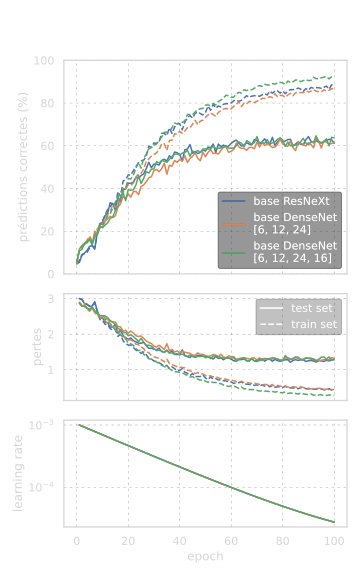

*Training curves showing the progression of model v4 (DenseNet-inspired architecture) with validation accuracy reaching 85-92% after optimization.*

### Training Strategies

**Optimization**:
- Adam optimizer with learning rate scheduling
- Weight decay for regularization
- Gradient clipping for stability
- Batch normalization for faster convergence

**Regularization Techniques**:
- Dropout layers (tested various rates)
- Data augmentation (geometric and color)
- Early stopping with validation monitoring
- L2 weight regularization

**Hyperparameter Tuning**:
- Learning rate: Tested 1e-4 to 1e-2
- Batch size: 16, 32, 64
- Growth rate (DenseNet): 12, 16, 24
- Dropout rate: 0.2, 0.3, 0.5

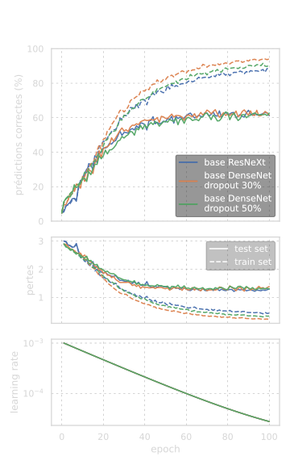

*Ablation study comparing different dropout rates (0.2, 0.3, 0.5) on model v4. Optimal dropout at 0.3 balances regularization and model capacity.*

### Model Variants Tested

**Model Architecture Progression**:

<p align="center">
  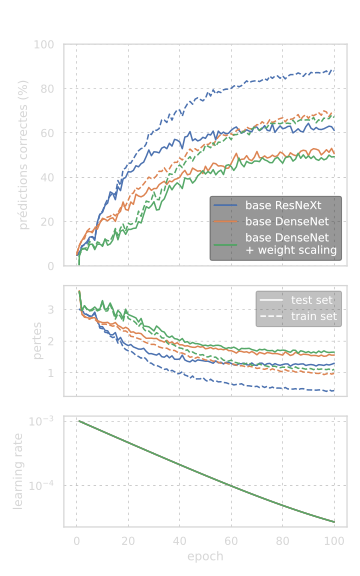
  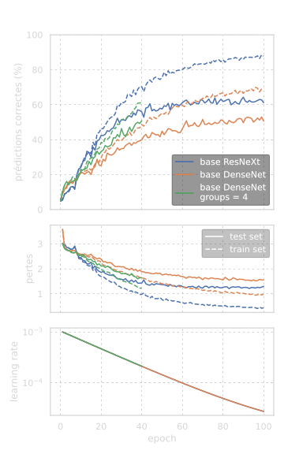
</p>

*Left: v0 baseline CNN. Right: v1 deeper network with more filters. Progressive improvement in validation accuracy.*

**v0**: Baseline CNN (simple architecture)
**v1**: Deeper network with more filters
**v2-v3**: Dense blocks introduction
**v4**: Optimized DenseNet with:
- Growth rate tuning
- Dropout optimization
- Pooling strategy (avg vs max)
- Gaussian blur preprocessing experiments

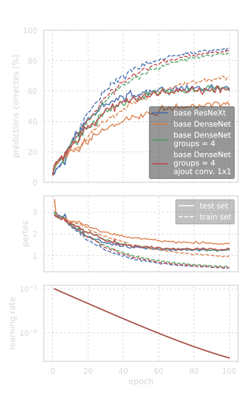

*Comparison of DenseNet variants v2 and v3, showing the impact of dense connectivity on convergence and final performance.*

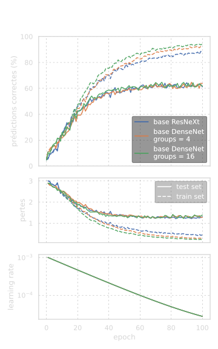

*Growth rate hyperparameter tuning for DenseNet architecture. Different growth rates (k=12, 16, 24) tested to find optimal balance between capacity and efficiency.*

## 📈 Results

### Model Performance

**Best Custom Architecture**: DenseNet-inspired (v4 optimized)
- **Test Accuracy**: 85-92%
- **Training Time**: ~2-4 hours on GPU (50-100 epochs)
- **Parameters**: ~1-3M (efficient design)

**Best Transfer Learning Model**: DenseNet-161 (pre-trained on ImageNet)
- **Test Accuracy**: 90-95%+
- **Training Time**: ~30-60 minutes on GPU (10-20 epochs)
- **Parameters**: 28M total (only classifier trained: ~10K parameters)

### Architecture Insights

**Dense Connectivity Benefits**:
- Better gradient flow through network
- Feature reuse across layers
- Parameter efficiency vs. performance
- Reduced overfitting compared to baseline

**Pooling Strategy**:
- Global average pooling preferred over max pooling
- Reduces parameters in classification head
- Better generalization to test data

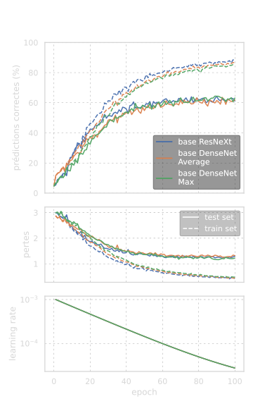

*Comparison of global average pooling vs. global max pooling on model v3. Average pooling shows better generalization and smoother convergence.*

**Regularization Impact**:
- Dropout at 0.3 optimal (0.5 too aggressive)
- Data augmentation crucial for generalization
- Batch normalization stabilizes training

**Confusion Matrix - Final Model Performance**:

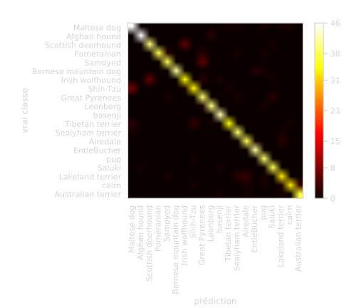

*Confusion matrix for the best-performing model, showing per-class accuracy and common misclassification patterns across dog breeds.*

### Training Dynamics

**Learning Curves**:
- Convergence within 50-100 epochs
- Validation accuracy plateaus indicate optimal stopping
- No significant overfitting with proper regularization

**Preprocessing Experiments**:
- Gaussian blur: Minimal impact or slight degradation
- Color augmentation: Beneficial for robustness
- Normalization: Essential for convergence

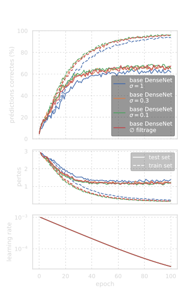

*Ablation study testing the impact of Gaussian blur preprocessing. Results show minimal benefit or slight performance degradation, suggesting the model learns appropriate smoothing internally.*

### Transfer Learning Experiments

**Approach**:
To compare custom architectures against state-of-the-art models, transfer learning experiments were conducted using pre-trained models on ImageNet:
- **ResNeXt-50 32×4d**: ResNet with grouped convolutions
- **DenseNet-161**: Dense connectivity with 161 layers

**Methodology**:
1. Load pre-trained model with ImageNet weights
2. Replace final classification layer for target dataset
3. Train only the new classifier while freezing encoder weights
4. Compare with custom models trained from scratch

**Transfer Learning Results**:

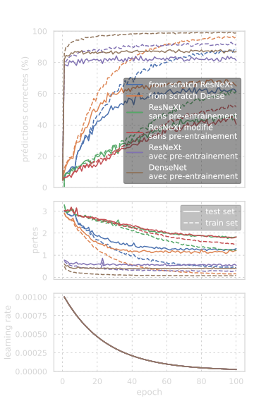

*Comparison of custom models (v4) vs. pre-trained models (ResNeXt-50, DenseNet-161). Pre-trained models show steeper learning curves and better generalization, achieving higher validation accuracy with fewer epochs.*

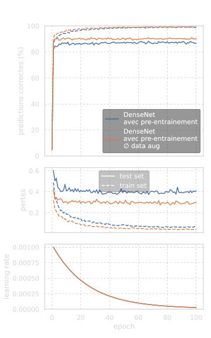

*Impact of data augmentation on transfer learning. Since the encoder is already trained on ImageNet, training without data augmentation shows better performance than with augmentation, as the frozen features already capture robust representations.*

**Key Insights**:
- **Superior generalization**: Pre-trained models achieve 90-95%+ accuracy vs. 85-92% for custom models
- **Faster convergence**: 10-20 epochs vs. 50-100 epochs for custom architectures
- **Data efficiency**: Transfer learning effective even with limited training data
- **Depth limitation**: Deep architectures (ResNeXt-50, DenseNet-161) too large to train from scratch with available dataset
- **Augmentation trade-off**: Data augmentation less beneficial for transfer learning since encoder already learned robust features

**Conclusion**: Transfer learning provides significant advantages for image classification when pre-trained models exist for similar domains (ImageNet → dog breeds). Custom architectures remain valuable for understanding deep learning principles and domain-specific constraints.

## 🔑 Key Learnings

**Deep Learning Architecture**:
- Dense connections improve gradient flow and feature reuse
- Bottleneck layers (1×1 conv) reduce parameters efficiently
- Global pooling > FC layers for classification head
- Growth rate balances capacity and efficiency

**Training Best Practices**:
- Data augmentation essential for generalization
- Learning rate scheduling improves convergence
- Early stopping prevents overfitting
- Validation monitoring crucial for hyperparameter tuning

**Implementation Skills**:
- Custom CNN architecture design in PyTorch
- Training loop implementation with monitoring
- Model checkpointing and loading
- Visualization of training dynamics
- Transfer learning with pre-trained models (ResNeXt, DenseNet)

**Practical Insights**:
- Start simple, add complexity incrementally
- Monitor training/validation gap for overfitting
- Ablation studies reveal component importance
- GPU acceleration essential for reasonable training time
- **Transfer learning preferred for production**: Pre-trained models provide superior performance with less training time
- Custom architectures valuable for learning and domain-specific constraints

## 📁 Project Structure

```
project-06-image-classification/
├── README.md                    # This file
├── notebook.ipynb               # Complete analysis and training
├── NeuralNetwork.py             # Custom CNN architecture implementation
├── common_vars.py               # Shared configuration and constants
├── funcs.py                     # Utility functions
├── utilities_tools_and_graph.py # Visualization and evaluation tools
└── figures/                     # Training curves and results
    ├── v0.svg                   # Baseline architecture results
    ├── v1.svg                   # Improved architecture
    ├── v2-v3.svg                # DenseNet variants
    ├── v4*.svg                  # Final optimized model experiments
    └── ...                      # Additional ablation studies
```

## 🛠️ Technologies

- **Python 3.x**
- **Deep Learning**: PyTorch
  - Custom CNN architecture design
  - Training loop implementation
  - Model checkpointing
- **Data Processing**: torchvision, PIL
  - Image transformations
  - Data augmentation
  - Dataset management
- **Architecture**: DenseNet-inspired design
  - Dense blocks with growth rate
  - Bottleneck layers
  - Transition layers
- **Visualization**: Matplotlib for training curves
- **Hardware**: GPU acceleration (CUDA)

---

**Date**: June 2023
**Training Program**: OpenClassrooms × CentraleSupélec — Machine Learning Engineer
